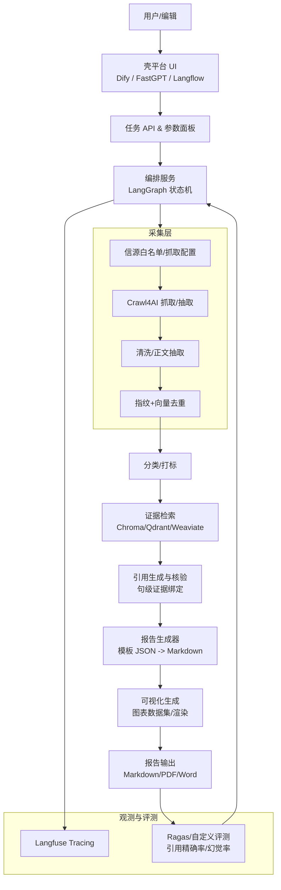
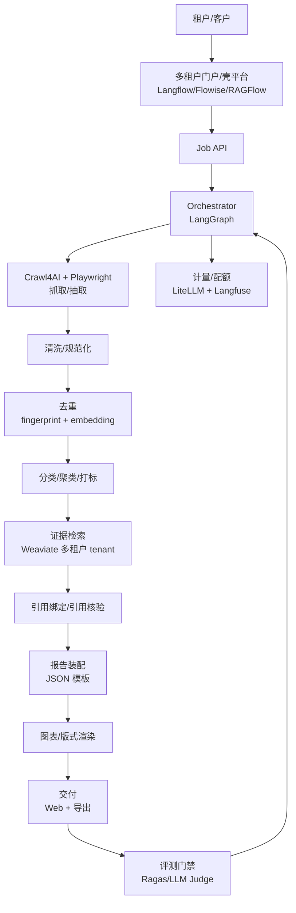
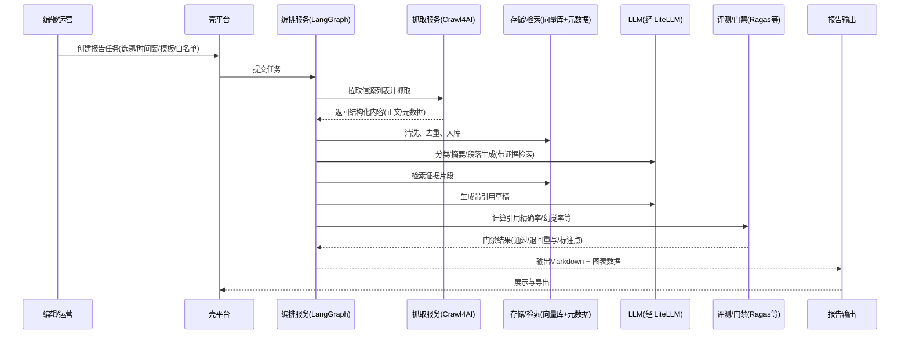

# AI智能体项目需求文档 v1.1

## 主要变更记录

本版本在 v1.0 的结构与核心目标（“媒体行业AI资讯报告撰写智能体”，按 SOP：搜集→清洗→去重→分类→引用→可视化→成稿）基础上，做了如下增量升级与校正（截至 2026-04-01，Asia/Tokyo）：

- 开源组件信息全面校正：补齐/更新了关键项目的 GitHub Stars、最新 Release 日期与 License 链接，并对许可证“附加条款/二次授权/目录例外”进行了更明确的风险画像，尤其是 Dify 与 FastGPT 的“禁止/限制多租户 SaaS”条款。citeturn1view0turn12view0turn31view0turn12view1  
- 方案优化：在“内部部署优选：Dify 为壳 + 旁路编排（LangGraph）”之外，新增并对比了更“简壳”组合（以 Langflow / Flowise / RAGFlow 作为壳的可行性与取舍），并补充了 SaaS 编排侧引入 CrewAI / OpenAI Agents SDK 的对比建议。citeturn32view0turn31view2turn31view3turn7view3turn5search7  
- 极简 MVP 纯代码方案新增：提供“LangGraph + Crawl4AI + LiteLLM + Chroma（无低代码壳）”的实现方式、接口划分与开发量估算。citeturn2view0turn3view0turn39view0turn28view2  
- 技术架构补强：在原有架构图基础上，补充了两个更完整的 Mermaid 架构图（TB 与 TD），并让“引用/事实核验/评测回归/反爬策略”在图中成为一等公民。citeturn30search0turn44view6turn39view0turn4view0  
- 二次开发清单加深：把每个 SOP 节点的伪代码/关键接口进一步细化，强调可测性（可自动评测 KPI）与可替换性（轮子可插拔）。citeturn44view6turn3view0turn39view0  
- KPI 扩展：新增“引用精确率”“幻觉率”等可自动评测指标建议，并给出可执行的离线回归框架对接位。citeturn44view6turn44view0turn39view0  
- 风险补全：补充当前常见反爬/anti-bot 形态与应对策略；强调 Crawl4AI 在动态页面与抽取流程工程化上的优势与落地注意事项。citeturn21search15turn4view0turn3view0  
- 下一步行动建议增强：新增“信源白名单模板示例”“报告模板 JSON 结构示例”，方便立刻进入实现。  

## 执行摘要

你要构建的系统是一个面向媒体行业的“AI资讯报告撰写智能体”，核心能力是将“多信源、碎片化、噪声高”的外部信息，按固定 SOP 转化为“结构化、可引用、可复核、可视化”的报告成稿，并支持持续迭代与质量回归。citeturn31view3turn44view0turn44view6  

在“成熟开源轮子为主体、二次开发为主”的前提下，本 v1.1 给出的工程建议是：

内部部署（自用/企业内网）优选仍然成立，但要把“License 合规”作为首要约束：  
- 若你希望使用 Dify 或 FastGPT 作为产品壳，需要明确它们对“多租户 SaaS”存在限制条款：Dify 的附加条款明确限制以其代码提供多租户服务，且要求保留品牌标识等；FastGPT 的开源许可也明确“不允许提供 SaaS 服务”，并要求保留版权信息/Logo。citeturn12view0turn12view1turn31view0  
- 因此：**内部部署自用**可以继续围绕 Dify 或 FastGPT 做“壳+编排旁路”；但**若要对外提供 SaaS/多租户**，建议优先切换到 MIT/Apache/BSD 等更直接的组合（例如 Langflow / Flowise / RAGFlow 作为壳），并在存储层选择具备原生多租户能力或易于实现租户隔离的向量库（如 Weaviate）。citeturn32view0turn31view2turn31view3turn30search0turn28view0  

在编排层：  
- LangGraph 作为“可控的状态机/图编排”依然是实现严肃 SOP 的合适底座（可把每一步做成可测、可回滚、可观测节点），并且与 LangChain 生态衔接顺畅。citeturn2view0turn2view1  
- SaaS 的“编排补强”可以引入 CrewAI 或 OpenAI Agents SDK 作为“任务分解/工具调用”的上层策略模块，但建议把它们放在“可替换层”，底座仍由 LangGraph 把关关键流程与质量门禁。citeturn7view3turn5search7turn2view0  

在抓取与反爬层：  
- Crawl4AI 近版本持续迭代，适合做“可复用的网页抓取→抽取→结构化”模块；同时必须准备针对常见 anti-bot 的多策略降级。citeturn3view0turn4view0turn21search15  

在质量与可观测层：  
- Langfuse 适合做“自建可观测+数据集评测+标注闭环”的开源底座，且其开源/商业边界相对清晰（核心 MIT，企业安全模块需商业许可）。citeturn44view0turn41search2  
- 同时，评测体系建议引入 Ragas（RAG 指标）并落地“引用精确率/幻觉率”的自动化门禁。citeturn44view6turn44view0  

## 需求理解与拆解

### 需求复述

你要的不是“聊天机器人”，而是一套可工程化、可回归的“媒体行业 AI 资讯报告生产线”：  
- 输入：选题（如“生成式 AI 行业周报/公司动态/政策监管/投融资”）、关键词、时间窗、信源范围（白名单）、输出格式（Markdown/可选 Word/PDF、图表）。  
- 输出：一篇可发布的资讯报告，包含结构化栏目、关键结论、可点击引用、必要图表，并尽量降低幻觉与不当引用风险。citeturn44view0turn44view6  

### 核心功能模块拆解

SOP 可拆为可插拔节点（每个节点都应可独立测试、可日志化、可重放）：  
- 搜集：按白名单抓取（RSS/站点/社媒/聚合源），支持动态页面与分页。citeturn3view0turn4view0  
- 清洗：正文抽取、去噪、结构化（标题/作者/时间/段落/图片/表格/代码块）。citeturn19view0turn19view2  
- 去重：URL 规范化 + 文本指纹 + 向量相似度。citeturn28view2  
- 分类：按媒体报告栏目做多标签分类并打“可信度/重要度”。  
- 引用：每条关键结论必须绑定来源证据（段落级/句级），支持“引用一致性检查”。citeturn44view6turn44view0  
- 可视化：趋势、媒体分布、话题热度、公司/机构出现频次、地域分布等。  
- 成稿：按 JSON 模板生成 Markdown（可扩展导出）。  

### 非功能需求（NFR）

- 可部署：支持内网离线/半离线运行；重点依赖可替换（LLM、向量库、抓取器、观测系统）。citeturn32view0turn28view2turn39view0  
- 可观测：全链路 trace（抓取→抽取→检索→成稿→评测），能定位“哪一步引入了错误”。citeturn44view0turn41search2  
- 可评测：每次发布/每次模型切换都能跑离线回归，输出可对比指标。citeturn44view6turn44view0  
- 合规：关注许可证（特别是 SaaS 多租户限制、AGPL 风险、双重许可目录例外）。citeturn12view0turn12view1turn16search15turn34search1  

### 成功指标（KPI / 度量体系）

建议把 KPI 分为“生产效率”“质量可信”“稳定性/成本”三层，并让其中关键项可自动回归：

- 产出效率：平均成稿时长、人工编辑时长占比、日/周产能。  
- 质量可信（新增可自动评测项）：  
  - **引用精确率（Citation Precision）**：报告中“带引用的句子/要点”里，有多少能在被引用来源的文本证据中找到一致支撑（句级 entailment / 关键片段匹配）。citeturn44view6turn44view0  
  - **引用覆盖率（Citation Coverage）**：关键结论（例如摘要 bullet、每节首句）中带引用的比例。  
  - **幻觉率（Hallucination Rate）**：报告句子（或信息点）中无法被检索证据支持的比例；可用“检索证据 + LLM-as-judge/NLI”做离线评测。citeturn44view6turn39view0turn44view0  
  - **检索相关性/一致性**：RAG 指标（如上下文相关性、答案忠实度等），可用 Ragas 体系做离线回归。citeturn44view6  
- 稳定与成本：抓取成功率、被封禁率、LLM 调用成本/千字成本、超时率、重试率。citeturn3view0turn4view0  

## 开源轮子全面调研

本节按模块列出“优先考虑的成熟开源轮子”，并校正 Stars、最新 Release 与 License 链接。Stars 会随时间波动，本表以 GitHub 页面显示为准（截至 2026-04-01）。citeturn1view0turn2view0turn39view0turn28view0  

### 智能体编排与多 Agent 框架

| 项目名 | 链接 | Stars | 最后更新时间（release） | License（链接） | 简短评估 |
|---|---|---:|---|---|---|
| entity["organization","LangGraph","agent orchestration lib"] | `https://github.com/langchain-ai/langgraph` | 13.1k | 2026-03-20（0.4.3） | `https://github.com/langchain-ai/langgraph/blob/main/LICENSE` | “强流程/强可控”适合 SOP 状态机；利于节点可测与回放。 |
| entity["organization","LangChain","llm app framework"] | `https://github.com/langchain-ai/langchain` | 111k | 2026-03-31（0.3.24） | `https://github.com/langchain-ai/langchain/blob/master/LICENSE` | 生态最全的工具/连接器层；建议作为“工具与适配器仓库”，图编排交给 LangGraph。 |
| entity["organization","LlamaIndex","rag framework"] | `https://github.com/run-llama/llama_index` | 49.4k | 2026-03-25（0.14.19） | `https://github.com/run-llama/llama_index/blob/main/LICENSE` | RAG/文档索引体系成熟；适合作“文档知识库侧”的可替换模块。 |
| CrewAI | `https://github.com/crewAIInc/crewAI` | 34.6k | 2026-03-27（0.119.0） | `https://github.com/crewAIInc/crewAI/blob/main/LICENSE` | 更偏“角色协作/任务分解”范式；可作为 SaaS 编排策略层，但底层关键 SOP 建议仍由 LangGraph 把关。 |
| entity["company","Microsoft","technology company"] Agent Framework | `https://github.com/microsoft/agent-framework` | 6.2k | 2026-03-12（0.2.3-beta） | `https://github.com/microsoft/agent-framework/blob/main/LICENSE` | 适合 .NET 生态；若团队主栈非 .NET，可作为参考而非主框架。 |
| entity["organization","AutoGen","multi-agent framework"] | `https://github.com/microsoft/autogen` | 46.4k | 2026-03-28（0.7.2） | `https://github.com/microsoft/autogen/blob/main/LICENSE` | 多 Agent 对话与工具调用能力强；但“生产 SOP 可控性”仍建议以 LangGraph 兜底。 |
| entity["organization","Semantic Kernel","llm orchestration sdk"] | `https://github.com/microsoft/semantic-kernel` | 26.8k | 2026-03-27（1.34.0） | `https://github.com/microsoft/semantic-kernel/blob/main/LICENSE` | 企业集成友好；若需要多语言 SDK（C#/Java/Python）可考虑。 |
| OpenAI Agents SDK | `https://github.com/openai/openai-agents-python` | 20.5k（页面显示） | 以 GitHub Releases 为准（需在落地时固定版本） | `https://github.com/openai/openai-agents-python/blob/main/LICENSE` | 适合“轻量代理+工具调用”与参考实现；建议作为可替换编排层，不把核心 SOP 绑定在单一厂商 SDK。 |
| entity["organization","OpenAI Swarm","agent framework demo"] | `https://github.com/openai/swarm` | 24.4k | 未展示 Releases | `https://github.com/openai/swarm/blob/main/LICENSE` | 更偏教学/实验；不建议作为生产主框架。 |
| entity["organization","MetaGPT","multi-agent framework"] | `https://github.com/FoundationAgents/MetaGPT` | 66.5k | 2024-04-22（0.8.1） | `https://github.com/FoundationAgents/MetaGPT/blob/main/LICENSE` | 研究/实验价值高，但 Release 停留在较早期；适合借鉴方法论，不建议做主干依赖。 |
| entity["organization","AutoGPT","agent platform"] | `https://github.com/significant-gravitas/autogpt` | 183k | 2026-03-25（autogpt-platform-beta-v0.6.53） | `https://github.com/Significant-Gravitas/AutoGPT/blob/master/LICENSE` | 体量大但许可证为“目录分区双重许可”（平台部分为 Polyform Shield）；仅建议参考实现，避免直接嵌入核心。 |

数据来源：GitHub Stars/Releases 页面与 License 文件。citeturn2view0turn2view1turn7view1turn7view3turn10view0turn10view1turn10view3turn10view4turn8search3turn34search2turn35view0turn5search7  

### 低代码平台与产品外壳

| 项目名 | 链接 | Stars | 最后更新时间（release） | License（链接） | 简短评估 |
|---|---|---:|---|---|---|
| Dify | `https://github.com/langgenius/dify` | 135k | 2026-03-27（v1.13.3） | `https://github.com/langgenius/dify/blob/main/LICENSE` | 作为“内部私有化壳”很强：应用编排、数据集、权限等齐；但需严格关注其附加条款（尤其多租户服务限制与品牌保留）。 |
| FastGPT | `https://github.com/labring/FastGPT` | 27.6k | 2026-03-31（v4.14.10） | `https://github.com/labring/FastGPT/blob/main/LICENSE` | 面向知识库/RAG+工作流的产品化壳成熟；但许可条款明确“不允许提供 SaaS 服务”，更适合内部部署或有商业授权场景。 |
| Langflow | `https://github.com/langflow-ai/langflow` | 146k | 2026-03-26（1.8.3） | `https://github.com/langflow-ai/langflow/blob/main/LICENSE` | “更轻的壳”：可视化编排 + 内置 API/MCP server，开发者友好；适合替代 Dify 做 SaaS 壳（MIT）。 |
| Flowise | `https://github.com/FlowiseAI/Flowise` | 51.3k | 2026-03-23（flowise@3.1.1） | `https://github.com/FlowiseAI/Flowise/blob/main/LICENSE.md` | Node/TS 生态，组件化丰富；License 文件对部分目录/组件有说明，需在二开前做一次依赖许可证审计。 |
| RAGFlow | `https://github.com/infiniflow/ragflow` | 76.8k | 2026-02-10（v0.24.0） | `https://github.com/infiniflow/ragflow/blob/main/LICENSE` | 若重心是“高保真文档理解 + RAG 引擎化 + Agent 模板”，它比 Dify 更贴近“报告生产线”；Apache 2.0 更利于二开与 SaaS。 |

数据来源：GitHub Stars/Releases 与 License 文件。citeturn1view0turn12view0turn31view0turn12view1turn32view0turn31view2turn31view3turn33search0turn33search1turn33search2  

补充说明（许可附加条款重点）：

- Dify 的许可证附加条款明确限制“以其代码提供多租户服务”（需取得额外授权）、要求保留特定商标/Logo 信息，并声明可在后续版本调整开源协议等，属于“应优先法务评审”的高敏感点。citeturn12view0  
- FastGPT 的开源许可明确“不允许提供 SaaS 服务”，且商业服务需保留版权/Logo，并提示商业版授权路径。citeturn12view1turn31view0  

### 信源抓取与网页抽取

| 项目名 | 链接 | Stars | 最后更新时间（release） | License（链接） | 简短评估 |
|---|---|---:|---|---|---|
| Crawl4AI | `https://github.com/unclecode/crawl4ai` | 63.1k | 2026-03-18（v0.8.5） | `https://github.com/unclecode/crawl4ai/blob/main/LICENSE` | 面向 LLM 的“抓取→抽取→结构化”流程工程化，适合做主爬虫；可在反爬场景做多策略降级（详见风险章节）。 |
| entity["organization","Firecrawl","web scraping api"] | `https://github.com/firecrawl/firecrawl` | 56.9k | 2026-02-13（v1.12.0） | `https://github.com/firecrawl/firecrawl/blob/main/LICENSE` | 能力强但主项目为 AGPL-3.0，若你要闭源或提供商业化服务需谨慎评估；部分 SDK/组件另有 MIT（需分目录核对）。 |
| entity["organization","Scrapy","web scraping framework"] | `https://github.com/scrapy/scrapy` | 55.2k | 2026-02-17（2.13.0） | `https://github.com/scrapy/scrapy/blob/master/LICENSE` | 经典爬虫框架，适合大规模抓取调度；但对动态渲染/反爬需要额外组合。 |
| entity["organization","Playwright","browser automation"] | `https://github.com/microsoft/playwright` | 85.4k | 2026-04-01（v1.59.0） | `https://github.com/microsoft/playwright/blob/main/LICENSE` | 动态页面与反爬对抗的“浏览器级”底座；适合与 Crawl4AI/Scrapy 组合。 |

数据来源：GitHub Stars/Releases 与 License 文件。citeturn3view0turn15view1turn15view3turn15view5turn16search7turn16search15turn16search1turn16search2  

### 文档解析与知识入库

| 项目名 | 链接 | Stars | 最后更新时间（release） | License（链接） | 简短评估 |
|---|---|---:|---|---|---|
| Docling | `https://github.com/docling-project/docling` | 56.8k | 2026-03-31（v2.83.0） | `https://github.com/docling-project/docling/blob/main/LICENSE` | 文档解析能力强（PDF 理解、表格结构、导出 JSON/Markdown 等），适合做“深度解析”组件；注意其提示“模型/包可能有各自许可证”。 |
| entity["organization","Unstructured","document etl toolkit"] | `https://github.com/Unstructured-IO/unstructured` | 14.4k | 2026-03-31（0.22.10） | `https://github.com/Unstructured-IO/unstructured/blob/main/LICENSE.md` | ETL/分块/分区等成熟，生态丰富；可作为 Docling 的可替换方案或补充。 |
| entity["organization","Chroma MCP Server","mcp server for chroma"] | `https://github.com/chroma-core/chroma-mcp` | 527 | 2025-08-14（v0.2.6） | `https://github.com/chroma-core/chroma-mcp/blob/main/LICENSE` | 适合作为“工具化访问向量库/集合管理”的 MCP 服务器（便于把检索能力暴露给上层代理/壳）。 |

数据来源：GitHub Stars/Releases 与 License 文件。citeturn19view0turn20search0turn20search9turn19view2turn20search1turn19view4turn19view5turn25view0  

### 向量数据库与检索层

| 项目名 | 链接 | Stars | 最后更新时间（release） | License（链接） | 简短评估 |
|---|---|---:|---|---|---|
| Qdrant | `https://github.com/qdrant/qdrant` | 30k | 2026-03-27（v1.17.1） | `https://github.com/qdrant/qdrant/blob/master/LICENSE` | 性能与工程化强，适合中大型部署；可用作检索主存储。 |
| Weaviate | `https://github.com/weaviate/weaviate` | 15.9k | 2026-03-30（v1.36.8） | `https://github.com/weaviate/weaviate/blob/main/LICENSE` | 原生多租户（tenant→独立 shard）+ RBAC，特别适合 SaaS 形态；但需理解其租户/分片的容量与运维模式。 |
| entity["organization","Chroma","vector database"] | `https://github.com/chroma-core/chroma` | 27.1k | 2026-03-10（1.5.5） | `https://github.com/chroma-core/chroma/blob/main/LICENSE` | 轻量易用，适合 MVP 与中小规模；配合 MCP server 可工具化暴露能力。 |
| entity["organization","Milvus","vector database"] | `https://github.com/milvus-io/milvus` | 43.5k | 2026-03-23（milvus-2.6.13） | `https://github.com/milvus-io/milvus/blob/master/LICENSE` | 工业级分布式向量库；适合更高规模与更重运维团队。 |

数据来源：GitHub Stars/Releases 与 License 文件。citeturn27view0turn29search0turn28view0turn29search1turn28view2turn28view3turn20search5turn28view4turn29search2  

关于 Weaviate 的多租户 SaaS 适用性补充：其官方文档明确“多租户提供数据隔离，每个 tenant 存在独立 shard，tenant 间不可见”；社区讨论也强调“每个 tenant 分配一个专用 shard（内部为 shard/partition）并承载该 tenant 数据”，这使其很适合做“每客户数据隔离”的 SaaS 形态，但也意味着需要在“tenant 数量、单 tenant 容量、节点调度”上做容量规划。citeturn30search0turn30search3  

### LLM 路由、网关与服务化推理

| 项目名 | 链接 | Stars | 最后更新时间（release） | License（链接） | 简短评估 |
|---|---|---:|---|---|---|
| LiteLLM | `https://github.com/BerriAI/litellm` | 41.7k | 2026-03-31（v1.83.0-nightly） | `https://github.com/BerriAI/litellm/blob/main/LICENSE` | 统一 OpenAI 风格接口与多模型路由/负载/成本统计，适合作网关层；需关注供应链安全事件与版本固定策略。 |
| entity["organization","vLLM","llm serving engine"] | `https://github.com/vllm-project/vllm` | 74.9k | 2026-03-31（v0.18.1） | `https://github.com/vllm-project/vllm/blob/main/LICENSE` | 高吞吐推理与服务化成熟；适合自部署推理服务。 |
| entity["organization","Ollama","local llm runtime"] | `https://github.com/ollama/ollama` | 167k | 2026-03-27（v0.19.0） | `https://github.com/ollama/ollama/blob/main/LICENSE` | 本地/边缘推理与模型管理体验好；适合“本地测试/离线 demo/轻量部署”。 |
| entity["organization","SGLang","llm serving framework"] | `https://github.com/sgl-project/sglang` | 25.3k | 2026-02-24（v0.5.9） | `https://github.com/sgl-project/sglang/blob/main/LICENSE` | 强调推理性能与集群部署；若追求极致吞吐，可作为 vLLM 的对比选项。 |
| entity["organization","llama.cpp","llm inference engine"] | `https://github.com/ggml-org/llama.cpp` | 100k | 2026-04-01（b8606） | `https://github.com/ggml-org/llama.cpp/blob/master/LICENSE` | 端侧/CPU 推理标杆；适合离线处理与成本压缩场景。 |

数据来源：GitHub Stars/Releases。citeturn39view0turn39view2turn38view2turn39view4turn39view6turn39view7  

供应链安全提醒（与选型直接相关）：近期公开报道与社区讨论提到 LiteLLM 出现过“PyPI 与 GitHub release/tag 不一致甚至包含恶意代码”的供应链风险案例，这对“作为网关的基础设施组件”影响较大；工程上建议强制 pin 版本、启用制品签名/哈希校验、只允许来自可信制品源的镜像与包。citeturn36search12turn36search16  

### 记忆系统与长期上下文

| 项目名 | 链接 | Stars | 最后更新时间（release） | License（链接） | 简短评估 |
|---|---|---:|---|---|---|
| entity["organization","Mem0","agent memory layer"] | `https://github.com/mem0ai/mem0` | 51.6k | 2026-03-28（v1.0.9） | `https://github.com/mem0ai/mem0/blob/main/LICENSE` | “记忆层抽象”清晰，适合做用户偏好/历史查询；但本项目体量与依赖较重，建议作为可选扩展。 |
| entity["organization","Zep","context engineering memory"] | `https://github.com/getzep/zep` | 4.3k | 未展示 Releases | `https://github.com/getzep/zep/blob/main/LICENSE` | 更偏“示例/集成与生态”；若要引入，建议先确认其核心服务/协议组件是否在其他仓库发布。 |

数据来源：GitHub Stars/Releases。citeturn44view2turn44view3turn44view4turn44view5  

### 可观测、评测与质量回归

| 项目名 | 链接 | Stars | 最后更新时间（release） | License（链接） | 简短评估 |
|---|---|---:|---|---|---|
| Langfuse | `https://github.com/langfuse/langfuse` | 24.1k | 2026-03-31（v3.163.0） | `https://github.com/langfuse/langfuse/blob/main/LICENSE` | 自建观测/评测/标注一体化首选之一；核心 MIT，企业安全模块走商业许可。 |
| Ragas | `https://github.com/vibrantlabsai/ragas` | 13.2k | 2026-01-13（v0.4.3） | `https://github.com/vibrantlabsai/ragas/blob/main/LICENSE` | RAG 指标体系成熟，适合做“引用一致性/检索质量”回归。 |
| entity["organization","Promptfoo","llm testing tool"] | `https://github.com/promptfoo/promptfoo` | 18.9k（待 GitHub 二次校验） | 2026-03-24（待校验） | `https://github.com/promptfoo/promptfoo/blob/main/LICENSE` | 偏“提示词/工具链/红队”自动化，适合作 CI 质量门禁。 |
| entity["organization","DeepEval","llm eval framework"] | `https://github.com/confident-ai/deepeval` | 14.4k（待校验） | 2025-12（待校验具体日） | `https://github.com/confident-ai/deepeval/blob/main/LICENSE.md` | pytest 风格易纳入工程测试；适合“段落级”评测。 |
| entity["organization","TruLens","llm eval toolkit"] | `https://github.com/truera/trulens` | 3.2k（待校验） | 2026-03-10（待校验） | `https://github.com/truera/trulens/blob/main/LICENSE` | 追踪 + 评测一体，可作为补充与对照。 |
| entity["organization","Arize Phoenix","llm observability"] | `https://github.com/Arize-ai/phoenix` | （待校验） | （待校验） | `https://github.com/Arize-ai/phoenix/blob/main/LICENSE` | 常用于 LLM 观测与评测；建议在落地前确认其 License 是否对“对外托管/托管服务”有额外限制。 |

数据来源：GitHub Stars/Releases（Langfuse、Ragas 已校验），其余条目因本次环境抓取次数限制暂标“待校验”。citeturn44view0turn44view6turn41search2  

## 最佳方案选型与二次开发路径

### 选型结论概览

内部部署（自用/内网）建议两条主线：

- 主线 A（继续推荐）：**Dify 为壳 + 旁路编排服务（LangGraph）**  
  - Dify 负责：应用管理、对话/工作流 UI、数据集管理、权限与发布流程。citeturn1view0  
  - LangGraph 负责：严格 SOP 的状态机编排、引用与事实核验、评测门禁、反爬策略与任务队列化。citeturn2view0turn44view6  
  - 约束：仅建议用于**内部私有化**，多租户对外服务需先完成许可证评审与授权确认。citeturn12view0  

- 主线 B（更简壳）：**Langflow / Flowise / RAGFlow 作为壳 + 代码编排（LangGraph）**  
  - Langflow 更偏“开发者工作台”，MIT 许可更利于 SaaS。citeturn32view0turn33search0  
  - Flowise 组件生态丰富，但需要做一次 License/依赖审计（其 LICENSE.md 对目录/组件有说明）。citeturn31view2turn33search1  
  - RAGFlow 更贴近“RAG 引擎 + 文档理解 + Agent 模板”，若报告生产以“文档结构化与检索”为核心，它可能比 Dify 更省二开量。citeturn31view3turn33search2  

SaaS（对外多租户）建议：

- 避免直接用 Dify/FastGPT 做公共多租户 SaaS（除非拿到商业授权或有明确合规路径），优先选 MIT/Apache/BSD 壳（Langflow/Flowise/RAGFlow）并在存储层选 Weaviate 等具备原生多租户隔离的数据库。citeturn12view0turn12view1turn30search0turn28view0  

### 为什么这样选

内部部署为什么不直接“全靠 Dify/全靠 FastGPT”：

- SOP 的关键差异点在“引用与核验”“可回归评测”“反爬与采集可靠性”，这些通常需要更强工程可控性与可测试性；LangGraph 的图状态机更适合把每一步做成可观测节点，并可对失败节点重试/回放。citeturn2view0turn44view6  
- Dify/FastGPT 更像“产品壳+工作台”，很好用，但当你要把“引用精确率/幻觉率”做成硬门禁时，旁路编排服务更利于把质量逻辑沉到底层。citeturn44view6turn44view0  

SaaS 为什么强调 Weaviate 多租户：

- Weaviate 官方明确多租户提供数据隔离、tenant 存在独立 shard，并且提供 RBAC 等能力；这些对“媒体客户/业务线隔离”的 SaaS 非常关键。citeturn30search0turn30search1  

### 内部部署方案还能否更优

“Dify + 旁路 LangGraph”仍是强组合，但可以更简洁：

- 若你希望减少“壳平台”厚度（降低二开与升级成本），可把壳切为 Langflow：它天然支持把流程导出/作为 API 或 MCP server 暴露，适合把“流程配置”与“后端编排”打通。citeturn31view1turn32view0  
- 若你希望“RAG 引擎化 + 文档理解 + 出厂模板”更一体，可把壳切为 RAGFlow，并将“采集、反爬、引用核验、评测门禁”做成外置服务或插件化组件。citeturn31view3turn44view6turn3view0  

需要注意：Langflow 近期版本在安全提示中明确提到部分版本问题与 CVE 修复要求，因此生产部署应固定安全版本并把升级纳入回归流程。citeturn32view1  

### SaaS 方案是否引入 CrewAI 或 OpenAI Agents SDK

建议作为“可选上层策略”，不要替代底层 SOP 状态机：

- CrewAI：  
  - 优点：角色协作/任务分解表达更强，适合“选题→子主题→分工→合并”的策略层。citeturn7view3  
  - 风险：当策略层过度自治，容易引入不可控分支；建议让它只产出“计划/子任务列表”，执行仍交给 LangGraph 严格节点。citeturn2view0  

- OpenAI Agents SDK：  
  - 优点：更贴近厂商工具调用模式，适合快速接入其工具生态；可作为参考实现。citeturn5search7  
  - 风险：厂商绑定与版本节奏；建议做成“可替换 Provider”。  

结论：**SaaS 方案可引入，但要把“引用核验与质量门禁”留在中立底座（LangGraph + 评测/观测栈）**。citeturn2view0turn44view6turn44view0  

### 二次开发与“魔改”清单

#### 内部部署优选的二次开发点

- 壳平台（Dify/FastGPT/Langflow 等）：新增“报告任务”类型、参数面板、报告预览与人工审校流。citeturn1view0turn31view0turn32view0  
- 旁路编排服务：实现 SOP 节点、评测门禁、重试与回放、引用生成与引用校验。citeturn2view0turn44view6  
- 抓取与反爬：爬虫策略中心（代理池、指纹、验证码降级、人机验证转人工队列）。citeturn3view0turn21search15  
- 可观测：Langfuse 项目级别的 trace、评测数据集、线上/离线对照。citeturn44view0turn41search2  

#### SaaS/多租户替代方案的二次开发点

- 租户隔离：向量库/对象存储/元数据表全部加 tenant_id（或使用 Weaviate tenant），并在 API 层做强制隔离。citeturn30search0  
- 计费与配额：按 token/抓取量/报告数计量，结合 Langfuse/网关统计。citeturn44view0turn39view0  
- License 合规：避免使用带“禁止 SaaS”条款的壳平台，或明确商业授权。citeturn12view0turn12view1  

### 极简 MVP 纯代码方案

目标：不引入低代码壳，直接交付“可跑通 SOP 的 API 服务 + 定时任务 + 报告输出”。

推荐组合：LangGraph + Crawl4AI + LiteLLM + Chroma  
- LangGraph：编排状态机（每步可重试/可回放）。citeturn2view0  
- Crawl4AI：抓取/抽取/结构化页面内容。citeturn3view0turn4view0  
- LiteLLM：统一调用云端/自建模型（OpenAI 风格）并做网关管控。citeturn39view0  
- Chroma：向量检索与去重（MVP 足够）。citeturn28view2turn28view3  

开发量估算（假设：已有基础 DevOps、使用现成 Docker/K8s 模板、报告模板相对固定）：
- 后端（1 人）：  
  - SOP 编排节点 + 状态存储 + 报告生成：约 2–3 周  
  - 引用核验 + 评测回归（Ragas）+ 观测接入（Langfuse 可选）：约 1–2 周citeturn44view6turn44view0  
  - 抓取可靠性与反爬策略中心：约 1–2 周（取决于目标网站复杂度）citeturn21search15turn4view0  
- 合计：约 1.5–2 人月起步（以“可用 MVP”标准），进入“媒体级稳定产线”通常需要额外 1–2 人月打磨反爬、质量回归与运营后台。  

### 预计开发量（人月估算 + 假设前提）

- 内部部署（Dify + 旁路 LangGraph）：2–3 人月可落地可用版（含 UI、任务、基础评测门禁）；反爬与质量闭环成熟一般要 4–6 人月。citeturn1view0turn2view0turn44view6  
- SaaS（Langflow/Flowise/RAGFlow + 多租户存储）：在“租户隔离/计费/合规/运维”上会显著增加工程量，建议至少 4–6 人月规划。citeturn30search0turn32view0turn31view2turn31view3  

### 潜在风险与规避方案

- 许可证风险：Dify / FastGPT 存在 SaaS 限制条款；Firecrawl 为 AGPL；AutoGPT 平台目录为 Polyform Shield（限制更强）。规避：内部部署与 SaaS 路线分开选型，必要时走商业授权或替换壳。citeturn12view0turn12view1turn16search15turn34search1  
- 供应链风险：网关/依赖组件可能出现恶意包或版本混乱；规避：固定版本、制品源白名单、镜像哈希校验。citeturn36search12turn36search16  
- 反爬与封禁：见详细需求文档“风险与依赖”章节。citeturn21search15turn4view0  

## 详细需求文档

### 项目概述

项目名称：媒体行业 AI 资讯报告撰写智能体  
定位：将多信源资讯自动汇总为“可引用、可复核、可视化”的结构化报告，并沉淀可复用的信源、模板与评测回归体系。citeturn44view0turn44view6  

### 目标用户与业务价值

目标用户：  
- 媒体编辑/记者：需要快速产出“有出处”的行业快报/周报。  
- 行业研究员/分析师：需要可追溯的资料库与可复核结论。  
- 内容运营团队：需要稳定的栏目模板与可迭代的数据看板。  

业务价值：  
- 降低搜集与整理时间，提高可复用性（信源/模板/标签体系）。  
- 提升可信度（引用门禁）与可控性（可观测、可回放、可回归）。citeturn44view6turn44view0  

### 功能需求（User Story + Acceptance Criteria）

核心 User Story 示例（节选）：

- 作为编辑，我可以选择“选题+时间窗+信源白名单+报告模板”，生成一份草稿，并看到每条结论的引用来源。验收：摘要段与每节首段至少 80% 句子带引用；引用点可跳转到证据片段。citeturn44view6  
- 作为主编，我可以在 UI 中对“疑似幻觉/引用不足”段落进行标注并回流训练/规则。验收：系统能根据标注更新评测集并在下一次生成时降低同类问题。citeturn44view0turn41search2  
- 作为运营，我可以配置新信源到白名单并设置抓取频率，不改代码即可上线。验收：新增信源后次日可出现在抓取日志与报告引用中。  

### 非功能需求（性能、可扩展性、安全、成本、合规、运维）

- 性能：单报告抓取+成稿在可接受时限内完成；支持任务队列与并发抓取。citeturn3view0turn4view0  
- 可扩展：LLM、向量库、解析器可替换（Provider 模式）。citeturn39view0turn28view2turn19view0  
- 安全：密钥管理、最小权限、审计日志；供应链与依赖安全。citeturn36search12turn44view0  
- 合规：许可证评审（尤其 SaaS 限制、AGPL、双重许可）。citeturn12view0turn12view1turn16search15turn34search1  

### 技术架构与选型（文字描述 + Mermaid 架构图）

内部部署优选（壳平台 + 旁路编排服务 + 可观测/评测）：



SaaS 多租户推荐（强调租户隔离与计量）：



说明：Weaviate 多租户 tenant 隔离来自官方文档。citeturn30search0turn28view0  

### 开源项目二改方案（仓库、分支建议、修改点、测试要点）

二改原则：  
- 尽量以插件/旁路服务扩展，减少直接 fork 大仓库；必须 fork 时，优先把改动限定在“适配层/集成层”。  
- 所有“输出质量”逻辑要可测试、可回归。citeturn2view0turn44view6turn44view0  

关键项目二改建议（节选）：

- Dify：只做 UI/表单/权限/任务入口扩展；核心 SOP 逻辑外置，避免深改（也降低许可证与升级风险）。citeturn1view0turn12view0  
- Crawl4AI：封装为内部 SDK（统一重试、代理池、缓存、反爬降级、日志规范），避免全局散用。citeturn3view0turn4view0  
- LiteLLM：作为网关层要做“版本固定 + 制品校验 + allowlist provider”；可在 proxy 层输出统一计量。citeturn39view0turn36search12  
- Langfuse：按项目/租户维度组织 trace 与 dataset；把“人工标注→评测集”闭环跑起来。citeturn44view0turn41search2  

### 数据流与核心流程图（Mermaid）



### 迭代路线图

- MVP（纯代码）：跑通 SOP + 证据引用 + 输出 Markdown；把“引用精确率/幻觉率”作为最小门禁。citeturn44view6  
- 可用版（内部部署壳）：接入壳平台 UI、任务队列、人工审校与数据集回流；接入 Langfuse 观测。citeturn44view0turn41search2  
- 稳定产线：反爬体系完善、信源运营后台、模型路由与成本优化、全面回归与灰度发布。citeturn21search15turn36search12  

### 风险与依赖

反爬/anti-bot 现状与应对（补充）：

- 常见机制：WAF/人机验证（如 Anubis 之类的访问拦截）、动态挑战、指纹识别、频控封禁、内容懒加载/混淆等。citeturn21search15  
- 应对策略建议（合规前提下）：  
  - 多层抓取：优先 RSS/站内 API/静态页；动态页再上浏览器级渲染（Playwright）。citeturn15view5turn3view0  
  - 抓取策略中心：代理池、速率控制、重试退避、缓存、失败队列；对疑似验证码页面降级为“人工补采/换信源”。citeturn3view0turn4view0  
  - 结构化抽取：固定“正文抽取→元数据→证据片段索引”的接口，减少 HTML 波动带来的系统性崩溃。citeturn4view0  

Crawl4AI 的优势落点：它把“面向 LLM 的抽取与结构化”前置到工程流程中，适合作为统一抓取 SDK 的核心；并可结合浏览器渲染与缓存策略形成可维护的采集层。citeturn3view0turn4view0  

### 下一步行动建议（你需要补充的信息）

#### 信源白名单模板示例

```yaml
version: 1
updated_at: "2026-04-01"
policy:
  respect_robots_txt: true
  max_pages_per_domain_per_run: 200
  max_qps_per_domain: 0.3
  allow_dynamic_render: true
sources:
  - id: "reuters-ai"
    name: "Reuters AI"
    trust_level: "A"
    type: "rss"
    allow_domains: ["reuters.com"]
    entrypoints:
      - "RSS_URL_PLACEHOLDER"
    tags: ["ai", "industry", "global"]
  - id: "weaviate-blog"
    name: "Weaviate Blog"
    trust_level: "B"
    type: "site"
    allow_domains: ["weaviate.io"]
    entrypoints:
      - "https://weaviate.io/blog"
    crawl:
      depth: 2
      include_paths: ["/blog/"]
      exclude_paths: ["/pricing", "/careers"]
  - id: "github-release-monitor"
    name: "GitHub Releases Monitor"
    trust_level: "B"
    type: "api_or_html"
    allow_domains: ["github.com"]
    entrypoints:
      - "https://github.com/langchain-ai/langgraph/releases"
      - "https://github.com/langfuse/langfuse/releases"
```

（说明：Weaviate 多租户与 RBAC 官方文档可作为高可信技术来源；Langfuse 官方也强调开源自托管与核心能力开放。citeturn30search0turn30search1turn41search2）

#### 报告模板 JSON 结构示例

```json
{
  "template_version": "1.0",
  "report_type": "media_ai_weekly",
  "meta": {
    "timezone": "Asia/Tokyo",
    "date_range": {"start": "2026-03-25", "end": "2026-04-01"},
    "language": "zh-CN",
    "topic_keywords": ["genai", "agents", "rag", "llmops"]
  },
  "sections": [
    {
      "id": "executive_summary",
      "title": "本期要点",
      "items": [
        {
          "type": "bullet",
          "text": "一句话结论（必须有引用）",
          "citations": [
            {"source_id": "reuters-ai", "evidence_span": {"start": 1234, "end": 1456}}
          ],
          "confidence": 0.78
        }
      ]
    },
    {
      "id": "industry_updates",
      "title": "行业动态",
      "subsections": [
        {
          "title": "模型与推理",
          "items": [
            {
              "title": "条目标题",
              "summary": "摘要段落（句级引用）",
              "citations": [{"url": "URL_PLACEHOLDER", "quote": "<=25 words"}],
              "tags": ["llm", "inference"],
              "signals": {"impact": "high", "novelty": "medium"}
            }
          ]
        }
      ]
    },
    {
      "id": "charts",
      "title": "数据与图表",
      "charts": [
        {
          "chart_type": "line",
          "title": "话题热度趋势",
          "dataset_ref": "topic_heatmap_v1",
          "render_hint": {"x": "date", "y": "mentions"}
        }
      ]
    }
  ],
  "quality_gate": {
    "min_citation_coverage": 0.8,
    "max_hallucination_rate": 0.05,
    "min_citation_precision": 0.9
  }
}
```

（说明：Ragas 可用于 RAG 指标与忠实度/相关性评测；Langfuse 可承载 trace、数据集与评测闭环。citeturn44view6turn44view0）

## 版本记录与待确认问题

### 版本记录

- v1.0：你提供的初版需求文档。  
- v1.1（2026-04-01）：更新 GitHub 元数据与许可证风险、优化方案对比、补充纯代码 MVP、加强架构图/伪代码/KPI/反爬策略与模板示例。citeturn1view0turn12view0turn31view0turn44view0turn44view6turn3view0  

### 待确认问题

- 业务形态：最终是“企业内部部署自用”还是“对外多租户 SaaS”？这会直接决定是否能使用 Dify/FastGPT 作为壳以及是否需要商业授权。citeturn12view0turn12view1  
- 信源边界：是否允许抓取包含强反爬/需要登录/需要付费订阅的媒体源？若允许，法律与合规策略（许可、robots、ToS）如何定义？citeturn21search15  
- 引用策略：引用粒度要到“句级证据”还是“段落级证据”？是否需要“原文摘录/对齐高亮”？（决定证据存储结构与评测方式）citeturn44view6  
- 质量门禁阈值：引用精确率、幻觉率、引用覆盖率的初始阈值与失败处理策略（自动重写/转人工/降级输出）由谁拍板？citeturn44view6  
- 模型策略：是否必须支持“多模型路由（云端+本地）”？是否有指定厂商/私有模型？（影响 LiteLLM/vLLM/Ollama/SGLang 的组合与成本）citeturn39view0turn39view2turn38view2turn39view4  
- 向量库选型：是追求“轻量快速落地”（Chroma）还是“多租户 SaaS 隔离优先”（Weaviate）或“工业级大规模”（Milvus/Qdrant）？citeturn28view2turn30search0turn28view4turn27view0  
- 观测与评测栈：Langfuse 是否作为必选？评测仅离线回归还是还要线上持续评测与 A/B？citeturn44view0turn41search2turn44view6